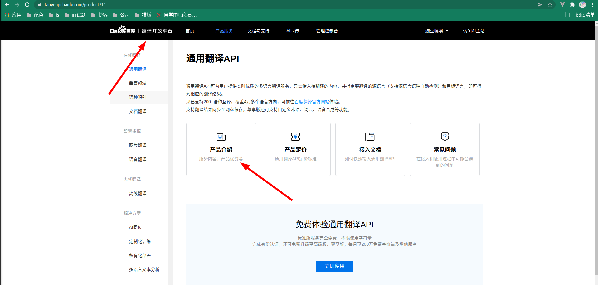

English Readme /  [简体中文说明](README.md)
# Instructions
Select the word after writing

- windows/linux:`ctrl+shift+t`

- mac:`cmd+shift+t`

# Exclusive Translation

1. The default is based on [Google 翻译](https://translate.google.cn)Reverse development，Support multi-language input and output, just use it directly

2. Based on the netease youdao to reverse-engineer [netease youdao] (https://fanyi.youdao.com/) without configuration Can be used directly

3. To support Baidu developer access, you need to configure the appid and key in the configuration items `Baidu Appid` and `Baidu Password`

[百度翻译官网直达](https://api.fanyi.baidu.com/product/11)

4. To support Ali developer access, you need to configure aid and key in the configuration items `Ali Access Key ID` and `Ali Access Key Secret`

[ali官网直达](https://www.aliyun.com/product/ai/alimt?spm=5176.21213303.8115314850.4.6bbf3edaYx4bLO&scm=20140722.S_card@@%E5%8D%A1%E7%89%87@@1954._.ID_card@@%E5%8D%A1%E7%89%87@@1954-RL_%E6%9C%BA%E5%99%A8%E7%BF%BB%E8%AF%91-OR_ser-V_2-P0_0)

`Baidu` with the` Ali` need to configure but only you can use more stable, although I can find me to help

`Google` and `netease youdao`, don't need any configuration, just select the button is good

# Language Control
## google
Abbreviation|Language
--|:--|
zh|Chinese
en|English
ru|Russian
fr|French
de|German
ko|Korean
ja|Japanese
th|Thai
es|Spanish

## wangyi
Language|Abbreviation
--|:--|
Chinese|zh-CHS
English|en
Japanese|ja
Korean|ko
French|fr
Spanish|es
Portuguese|pt
Italian|it
ru|ru
Vietnamese|vi
erman |de
## baidu
### 语言简称对照
Abbreviation|Language
--|:--|
zh|Chinese|
en|English|
yue|Cantonese|
wyw|Classical Chinese|
jp|Japanese|
kor|Korean|
fra|French|
spa|Spanish|
th|Thai|
ara|Arabic|
ru|Russian|
pt|Portuguese|
de|German|
it|Italian language|
el|Greek|
nl|Dutch|
pl|Polish|
cht|traditional Chinese|
vie|Vietnamese|

### Error Code
error code|meaning|solution
--|:--|:--|
52001|Request timed out|Retry|
52002|system error|Retry|
52003|Unauthorized user|Check if your appid is correct, or whether the service is opened|
54000|Required parameter is empty|Check if there is a small parameter|
54001|Signature error|Please check your signature generation method|
54003|Access frequency is limited|Please reduce your call frequency|
54004|Insufficient account balance|Please visit the management console for account recharge|
54005|Long query request frequent|Please reduce the transmission frequency of long query, then try again|
58001|Translation language is not supported|Check if the translation language is in the language list|
58002|Service is currently closed|Please go to the management console to open the service|
90107|Certification has not passed or not effective|Please visit my certification to view the progress of authentication|

## ali
Abbreviation|Language
--|:--|
zh|Chinese|
en|English|
yue|Cantonese|
ja|Japanese|
ko|Korean|
fr|French|
es|Spanish|
th|Thai|
ar|Arabic|
ru|Russian|
pt|Portuguese|
de|German|
it|Italian language|
el|Greek|
nl|Dutch|
pl|Polish|

# Version
## 1.0.0
1. The initial version, you can customize the configuration of the translation language. Default languages such as `Chinese, Japanese, and Korean` are converted to `English` by default; languages such as `English` are converted to `Chinese` by default
2. Google translation source supports click on `View More` to select other translations, click and copy operation
## 1.0.1
1. Increase the automatic replication function Default Close You can turn it on in the settings
2. Improve the introduction, update instructions

## 1.1.0
1. Added netease Youdao Translation
2. Optimize code logic
# Planning
1. Simplify operation and support floating translation
2. Join Baidu reverse translation, Jinshan translation reverse, etc.
3. No need for user configuration to switch between multiple translation engines

# End
1. If there is a problem, contact the author git raise a bug, I wish you a happy use