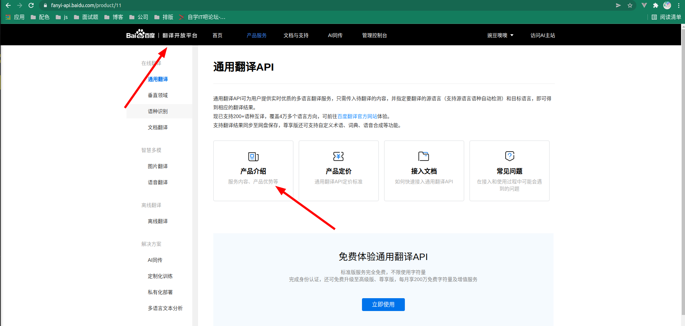

简体中文说明  / [English Readme](README.en.md)

# Exclusive Translation

1. 默认基于 [Google 翻译](https://translate.google.cn)逆向开发，支持多语言输入 输出,直接使用即可
2. 支持百度开发者接入需要 在配置项 `Baidu Appid` 以及 `Baidu Password` 中配置 appid 以及 密钥

3. 支持阿里开发者接入需要 在配置项 `Ali Access Key ID` 以及 `Ali Access Key Secret` 中配置 aid 以及 key

2跟3 需要配置 但是 只有你自己能用 更稳定 虽然麻烦了一点 可以找我帮忙
1 是不需要任何配置的 直接使用就好

# Instructions
1. 按键激活
windows/linux用户:`ctrl+shift+t`
mac用户:`cmd+shift+t`

目前只支持按键激活

# Version
## 1.0.0
1. 初始化版本,可自定义配置翻译语言 默认`中日韩`等语言 默认转换成`英文`;`英文`等语言默认转换成`中文`
2. google翻译源支持点击 `查看更多` 进行选择其他翻译 点击并实现复制操作

# Planning
1. 简化操作 并 支持 悬浮 翻译
2. 加入百度逆向翻译,金山翻译逆向等
3. 不需要用户配置进行多翻译引擎的切换

# End
1. 有问题 联系作者 git 提bug 祝您使用快乐