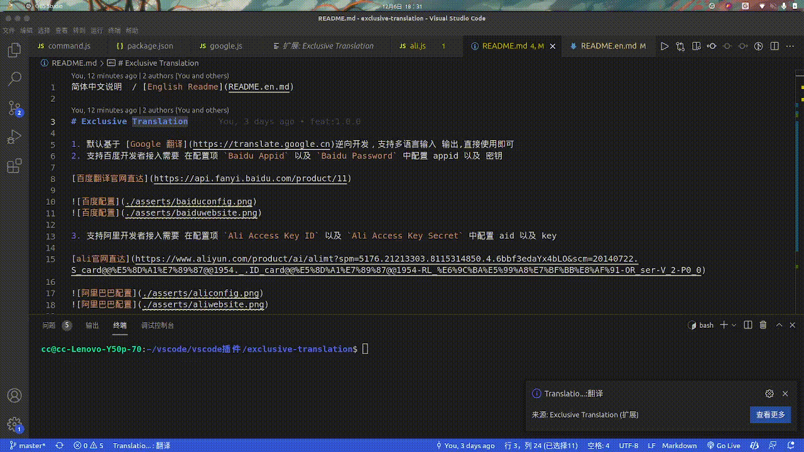
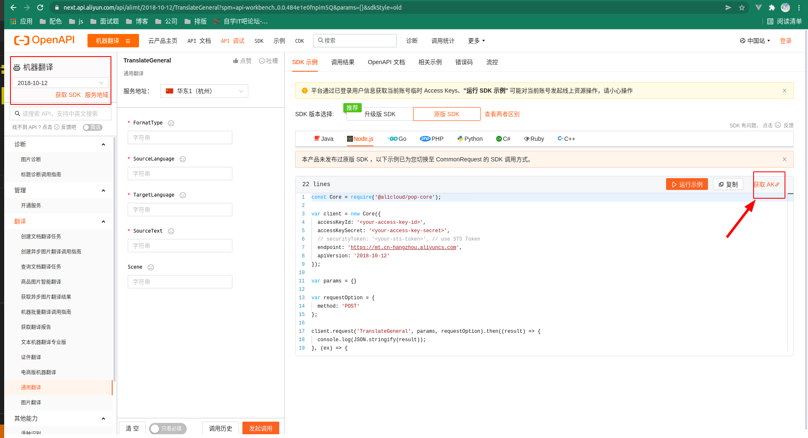
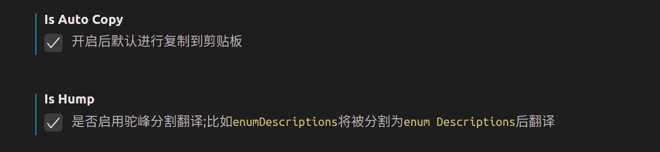

简体中文说明  / [English Readme](README.en.md)

# 使用说明

`选中文字后按键`

## 翻译
- windows/linux用户 : `ctrl+shift+t`

- mac用户 : `cmd+shift+t`

## 替换
- windows/linux用户 : `ctrl+alt+r`

- mac用户 : `ctrl+cmd+r`

- 如果遇到快捷键冲突请到设置中配置快捷键
- 由于`Google` 以及 `网易` 翻译引擎是逆向做的,官方改了规则就没办法用了 可以及时的 提`Issues`给我

# 简介

1. 默认基于 [Google 翻译](https://translate.google.cn)逆向开发，支持多语言输入 输出,直接使用即可

2. 基于网易有道逆向开发[网易有道](https://fanyi.youdao.com/) 无需配置 直接使用即可

3. 支持百度开发者接入需要 在配置项 `Baidu Appid` 以及 `Baidu Password` 中配置 appid 以及 密钥

[百度翻译官网直达](https://api.fanyi.baidu.com/product/11)

4. 支持阿里开发者接入需要 在配置项 `Ali Access Key ID` 以及 `Ali Access Key Secret` 中配置 aid 以及 key

[ali官网直达](https://www.aliyun.com/product/ai/alimt?spm=5176.21213303.8115314850.4.6bbf3edaYx4bLO&scm=20140722.S_card@@%E5%8D%A1%E7%89%87@@1954._.ID_card@@%E5%8D%A1%E7%89%87@@1954-RL_%E6%9C%BA%E5%99%A8%E7%BF%BB%E8%AF%91-OR_ser-V_2-P0_0)

`百度`跟 `阿里` 需要配置 但是 只有你自己能用 更稳定 虽然麻烦了一点 可以找我帮忙

`Google`以及`网易`是不需要任何配置的 直接选中后 按键 就好

# 配置项
- 翻译引擎的选择

- 是否进行自动复制/是否自动进行驼峰转义

- 翻译输出

# 语言对照表
## google
简称|语言
--|:--|
zh|中文
en|英文
ru|俄语
fr|法语
de|德语
ko|韩语
ja|日语
th|泰语
es|西班牙语

## 网易有道
语言|简称
--|:--|
中文|zh-CHS
英文|en
日文|ja
韩文|ko
法文|fr
西班牙文|es
葡萄牙文|pt
意大利文|it
俄文|ru
越南文|vi
德文|de
阿拉伯文|ar
印尼文|id
南非荷兰语|af
波斯尼亚语|bs
保加利亚语|bg
粤语|yue
加泰隆语|ca
克罗地亚语|hr
捷克语|cs
丹麦语|da
荷兰语|nl
爱沙尼亚语|et
斐济语|fj
芬兰语|fi
希腊语|el
海地克里奥尔语|ht
希伯来语|he
印地语|hi
白苗语|mww
匈牙利语|hu
斯瓦希里语|sw
克林贡语|tlh
拉脱维亚语|lv
立陶宛语|lt
马来语|ms
马耳他语|mt
挪威语|no
波斯语|fa
波兰语|pl
## 百度
### 语言简称对照
简称|语言|
--|:--|
zh|中文|
en|英文|
yue|粤语|
wyw|文言文|
jp|日语|
kor|韩语|
fra|法语|
spa|西班牙语|
th|泰语|
ara|阿拉伯语|
ru|俄语|
pt|葡萄牙语|
de|德语|
it|意大利语|
el|希腊语|
nl|荷兰语|
pl|波兰语|
bul|保加利亚语|
est|爱沙尼亚语|
dan|丹麦语|
fin|芬兰语|
cs|捷克语|
rom|罗马尼亚语|
slo|斯洛文尼亚语|
swe|瑞典语|
hu|匈牙利语|
cht|繁体中文|
vie|越南语|

### 错误码
错误码|含义|解决办法
--|:--|:--|
52001|请求超时|重试|
52002|系统错误|重试|
52003|未授权用户|检查您的 appid 是否正确，或者服务是否开通|
54000|必填参数为空|检查是否少传参数|
54001|签名错误|请检查您的签名生成方法|
54003|访问频率受限|请降低您的调用频率|
54004|账户余额不足|请前往管理控制台为账户充值|
54005|长query请求频繁|请降低长query的发送频率，3s后再试|
58000|客户端IP非法|检查个人资料里填写的 IP地址 是否正确|可前往管理控制平台修改|IP限制，IP可留空|
58001|译文语言方向不支持|检查译文语言是否在语言列表里|
58002|服务当前已关闭|请前往管理控制台开启服务|
90107|认证未通过或未生效|请前往我的认证查看认证进度|

## 阿里巴巴
简称|语言|
--|:--|
zh|中文|
en|英文|
yue|粤语|
ja|日语|
ko|韩语|
fr|法语|
es|西班牙语|
th|泰语|
ar|阿拉伯语|
ru|俄语|
pt|葡萄牙语|
de|德语|
it|意大利语|
el|希腊语|
nl|荷兰语|
pl|波兰语|

# 版本

## 1.3.0
1. 增加国际化功能
2. 增加默认语言
3. 优化报错信息

## 1.2.0
1. 增加替换功能

## 1.1.1
1. 优化配置项 以及 优化简介
2. 增加驼峰分割翻译

## 1.1.0
1. 增加网易有道翻译
2. 优化代码逻辑

## 1.0.1
1. 增加自动复制功能默认关闭可以在设置中进行开启关闭
2. 完善简介,更新使用说明

## 1.0.0
1. 初始化版本,可自定义配置翻译语言 默认`中日韩`等语言 默认转换成`英文`;`英文`等语言默认转换成`中文`
2. google翻译源支持点击 `查看更多` 进行选择其他翻译 点击并实现复制操作

# 最后
1. 有问题 联系作者 git 提bug 祝您使用快乐